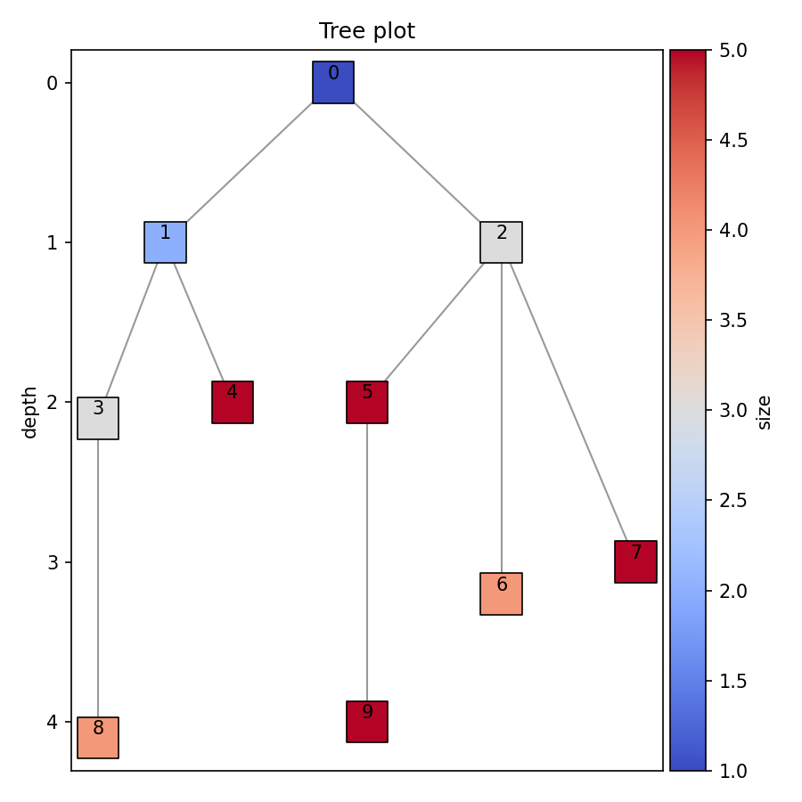

## TreeVis

***TreeVis*** is a lightweight web-based visualization app for hierarchical and tree-shaped data. 

It runs entirely in the browser through the live web app—no download, installation, or local setup required.

👉 **Try it here:** [https://fancyvis.github.io/TreeVis/](https://fancyvis.github.io/TreeVis/)

Given a simple CSV describing node-parent relationships, TreeVis lets you preview the data, customize node and edge styles, adjust figure settings, and export the final visualization as PNG or SVG.

### Quick start

1. Open the [TreeVis web app](https://fancyvis.github.io/TreeVis/).
2. Upload a CSV file containing tree structure columns.
3. Select the *ID* and *Parent ID* columns, and optionally specify *Depth* and *Label* columns.
4. Customize the plot:
   - **Edges:** route, color, linestyle, linewidth, alpha
   - **Nodes:** size, marker, face/edge color, linewidth, alpha
   - **Figure:** title, size, DPI, annotations, output format
5. Click **Generate** to render the tree.
6. Download the result as **PNG** or **SVG**.

### Input format

TreeVis expects a CSV with the following columns:

- **ID** — node identifier
- **Parent** — parent node identifier
- **Depth** *(optional)* — depth / level of the node
- **Label** *(optional)* — text label to show on the plot

Common column names such as `id`, `nid`, `parent`, `pid`, `depth`, `level`, `label`, and `name` are supported automatically.

### Example CSV

You can include an example input file in the repo, for example at:

[`example_data/small_example.csv`](example_data/small_example.csv)

Preview:

```csv
nid,pid,depth,size,label
0,,0,1,A
1,0,1,2,B
2,0,1,3,C
3,1,2.1,3,D
4,1,2,5,E
5,2,2,5,F
```

### Example Output

Below is an example tree visualization generated by ***TreeVis*** from the above CSV input:



See [`example_figure/small_example_parameters.txt`](example_figure/small_example_parameters.txt) for the customized plot settings.